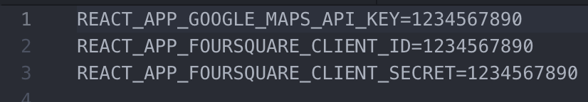

# Brewluth
Brewluth allows users of the app to discover, filter through, and learn about the breweries local to Duluth, Minnesota.

## Table of Contents
* [Installation](#Installation)
* [Additional notes](#Additional notes)
* [Contributing](#Contributing)
* [Dependencies](#Dependencies)

## Installation
* Download the contents of this repository by clicking "Clone or download." From here, you may clone the repo using SSH/HTTPS or download the files in a .zip folder.
* Navigate to the project folder and install its dependencies by running `npm install` in your command line interface.
* You will need the required API keys for both Google Maps and Foursquare. You can obtain them from the respective developer guides.
* Once you have your keys, open your code editor of choice, create a file called `.env` in the root directory, and add your keys using these three variables: `REACT_APP_GOOGLE_MAPS_API_KEY`, `REACT_APP_FOURSQUARE_CLIENT_ID`, and `REACT_APP_FOURSQUARE_CLIENT_SECRET`. Below is a screenshot demonstrating this with example keys.

* Now, run `npm start` in your CLI.
* Your default browser should now open the app at `http://localhost:3000`, but if it doesn't, feel free to navigate there yourself.

## Additional notes
* This project was bootstrapped with [Create React App](https://github.com/facebook/create-react-app).
* If you'd like to run a production (build) installation, you must use `npm build` and initiate the server with `serve -s build`.
* The app will appear in your default browser at `http://localhost:5000`.
* The default service worker is used in this app; because of this, it only works in the production build.

## Contributing
* While this was a fun personal project, I welcome pull requests or issue reports at any time. Feel free to fork it and have fun!

## Dependencies
* [Google Maps API](https://developers.google.com/maps/documentation/)
* [Foursquare API](https://developer.foursquare.com)
* [axios](https://www.npmjs.com/package/axios)
